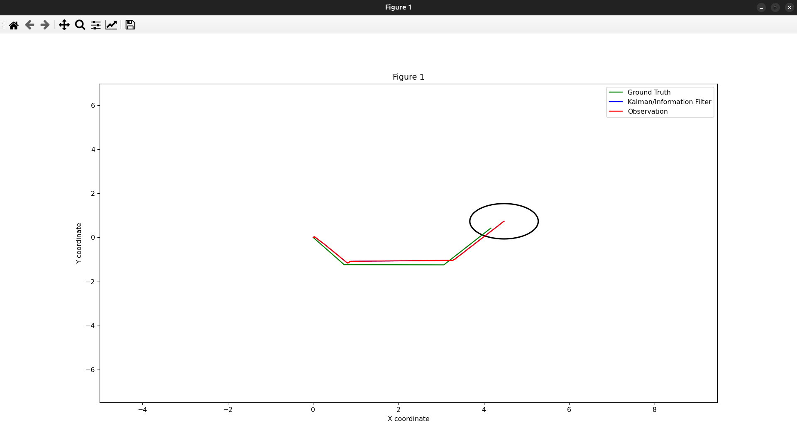
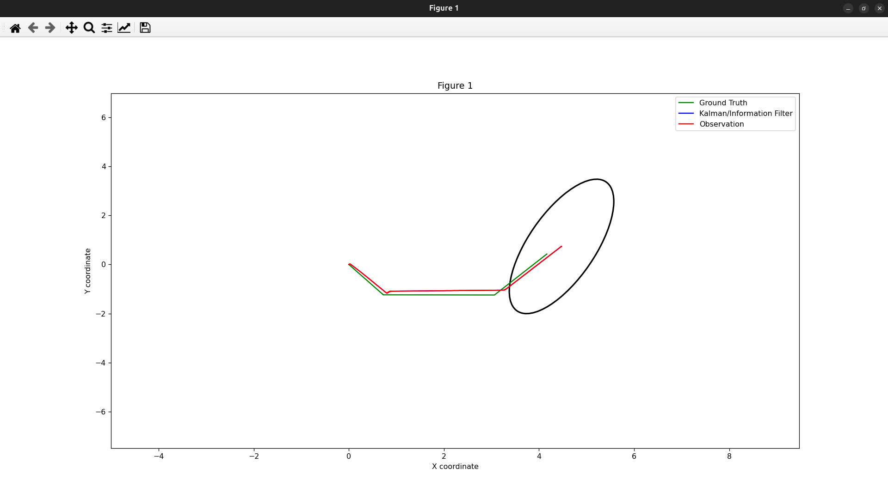
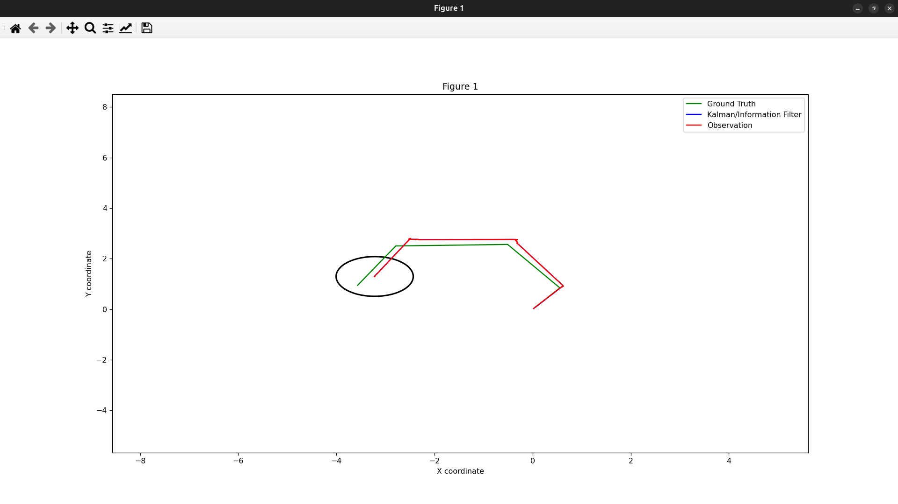

# Práctica 3: Filtro de Kalman Extendido
**Ampliación de Robótica - Curso 2024/2025**  
**José Francisco López Ruiz**

## Objetivos

Implementar un Filtro de Kalman Extendido (EKF) para estimar la localización de un robot móvil utilizando diferentes modelos de movimiento y observación. El sistema integra datos de odometría e IMU mediante fusión sensorial, comparando tres configuraciones de estado diferentes.

## Desarrollo de la Práctica

### Modelos de Estado Implementados

Se han desarrollado tres modelos de estimación con diferentes niveles de complejidad:

#### 1. EKF 3D (`ekf_estimation_3d.py`)
- **Estado**: `[x, y, θ]` - posición y orientación
- **Sensores**: Odometría únicamente
- **Propósito**: Modelo base para comparación

#### 2. EKF 7D (`ekf_estimation_7d.py`)  
- **Estado**: `[x, y, θ, v, ω, ax, ay]` - posición, velocidades y aceleraciones
- **Sensores**: Fusión odometría + IMU
- **Ventaja**: Información directa de orientación, velocidades angulares y aceleraciones desde IMU

#### 3. EKF 8D (`ekf_estimation_8d.py`)
- **Estado**: `[x, y, θ, vx, vy, ω, ax, ay]` - velocidades cartesianas separadas  
- **Sensores**: Fusión odometría + IMU
- **Ventaja**: Mayor precisión en trayectorias curvilíneas

### Implementación Técnica

#### Modelos de Movimiento
- `velocity_motion_models.py`: Función de transición g y Jacobiano Gt para el modelo 3D
- `acceleration_motion_models.py`: Modelos con aceleración para configuraciones 7D y 8D

#### Modelos de Observación
- `odometry_observation_models.py`: Observación de [x, y, θ] para modelo 3D
- `odometry_imu_observation_models.py`: Fusión sensorial para modelos 7D y 8D

#### Filtro EKF (`filters/ekf.py`)
Implementación de las etapas principales:
- **Predicción**
- **Corrección**

## Resultados y Análisis

### Configuraciones de Ruido Evaluadas

Se evaluaron tres escenarios de ruido para cada modelo:

1. **Configuración Balanceada** (caso base)
2. **Alta incertidumbre en observación** (Q aumentado)  
3. **Alta incertidumbre en movimiento** (R aumentado)

### Resultados Obtenidos

A continuación se muestran las configuraciones balanceadas de cada filtro:

#### EKF 3D - Configuración Balanceada

**Análisis**: Seguimiento básico efectivo con convergencia adecuada hacia el ground truth. Las observaciones ruidosas (incluso con bias) son filtradas correctamente.

#### EKF 7D - Fusión Sensorial

**Análisis**: No se observa mejora con respecto al filtro anterior. Es posible que requiera tuning de parámetros.

#### EKF 8D - Modelo Extendido

**Análisis**: Mejora significativa en precisión gracias a la fusión sensorial. La información del IMU compensa las derivas de odometría.

### Comparación de Modelos

| Modelo | Dimensiones | Sensores | Complejidad | Precisión | Aplicación |
|--------|-------------|----------|-------------|-----------|------------|
| EKF 3D | 3 | Odometría | Baja | Buena | Localización básica |
| EKF 7D | 7 | Odometría + IMU | Media | Mala | Localización más robusta |
| EKF 8D | 8 | Odometría + IMU | Alta | Muy Buena | Trayectorias complejas |

## Conclusiones

1. **Efectividad del EKF**: Demostrada capacidad para manejar no-linealidades en estimación robótica
2. **Valor de la fusión sensorial**: Mejora sustancial con integración odometría + IMU
3. **Escalabilidad**: Arquitectura modular permite fácil extensión a modelos más complejos
4. **Aplicabilidad**: Implementación directamente utilizable en robots móviles reales

La práctica demuestra que el Filtro de Kalman Extendido es una herramienta efectiva para estimación de estado robótica, especialmente cuando se combina con fusión sensorial apropiada. 